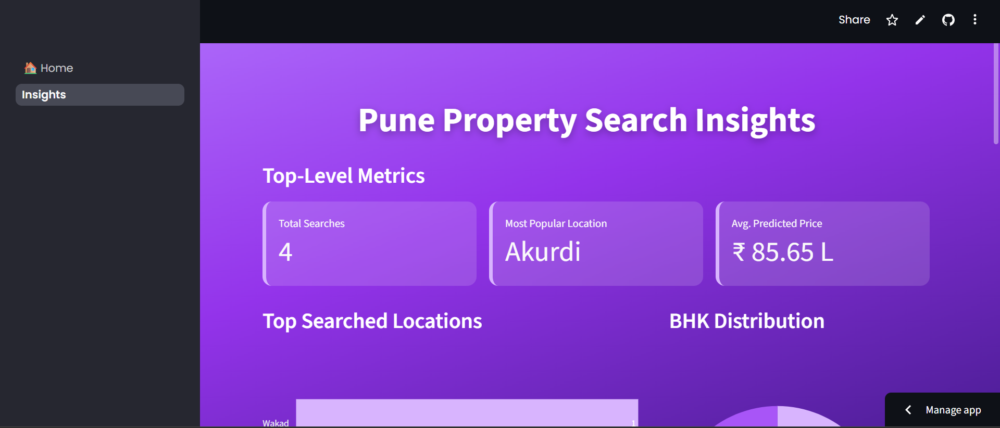

# HomeScout AI 🏠: Pune House Price Predictor

A data-driven web application built with Streamlit that predicts house prices in Pune. It features a live cloud database to store user searches and a dynamic insights dashboard to visualize search trends.

**[➡️ View the Live Demo](https://homescoutai.streamlit.app/)**

---

## 📸 Screenshots

### Home Page (Prediction)
The main page where users can input property details to get a price estimate and find real-time listings.


### Insights Page (Dashboard)
A dynamic dashboard that connects to a live Supabase database to visualize all historical user searches.



---

## 🌟 Key Features

* **📈 Real-Time Price Prediction:** Utilizes a trained Scikit-learn regression model (`.pkl` file) to estimate prices based on:
    * Location in Pune
    * House Type (Apartment, Villa, etc.)
    * Area (in Sq. Ft.)
    * Number of Bedrooms (BHK)
* **🔗 Live Listing Integration:** Generates dynamic search URLs for major real estate portals (99acres, MagicBricks, etc.) based on the user's inputs.
* **☁️ Cloud Database:** All user searches (inputs and predicted price) are saved to a cloud-hosted **Supabase (PostgreSQL)** database.
* **📊 Dynamic Insights Dashboard:** A separate page queries the Supabase database to provide live analytics on user search behavior, including:
    * Top-Level Metrics (Total Searches, Most Popular Location)
    * Top Searched Locations
    * BHK Distribution (Pie Chart)
    * Average Predicted Price by Location

---

## 🛠️ Tech Stack & Architecture

This project is built on a modern, cloud-native stack:

* **Frontend:** **Streamlit** (for the UI and dashboard)
* **Backend:** **Python**
* **Database:** **Supabase (PostgreSQL)** (for storing search history)
* **ML Model:** **Scikit-learn** (for the regression model)
* **Data Manipulation:** **Pandas**
* **Database Connection:** **SQLAlchemy** & **psycopg2-binary**
* **Visualization:** **Plotly Express**

### Simple Architecture

1.  **User (Home Page):** Enters property details into the Streamlit UI.
2.  **ML Model:** The `pune_house_price_model` file is loaded to predict the price.
3.  **Database (Write):** The search query and its result are written to the Supabase PostgreSQL database using SQLAlchemy.
4.  **User (Insights Page):** Navigates to the "Insights" page.
5.  **Database (Read):** The Streamlit app queries the Supabase database for all historical search data.
6.  **Dashboard:** Plotly is used to build and display the visualizations based on the queried data.

---

## 🚀 How to Run Locally

To run this project on your local machine, follow these steps:

1.  **Clone the Repository**
    ```bash
    git clone [https://github.com/YOUR_USERNAME/YOUR_REPO_NAME.git](https://github.com/YOUR_USERNAME/YOUR_REPO_NAME.git)
    cd YOUR_REPO_NAME
    ```

2.  **Create a Virtual Environment** (Recommended)
    ```bash
    python -m venv venv
    source venv/bin/activate  # On Windows: venv\Scripts\activate
    ```

3.  **Install Dependencies**
    Ensure you have a `requirements.txt` file with all the libraries.
    ```bash
    pip install -r requirements.txt
    ```

4.  **Set Up Supabase & Secrets**
    * Create a free account on [Supabase](https://supabase.com/) and create a new project.
    * Go to **Database** -> **Connection** -> **Transaction pooler**.
    * Create a `.streamlit` folder in your project's root.
    * Inside it, create a `secrets.toml` file and paste your **Connection Pooler** credentials:

    ```toml
    [db_credentials]
    user = "postgres.YOUR_PROJECT_ID"
    password = "YOUR_DATABASE_PASSWORD"
    host = "aws-0-REGION.pooler.supabase.com"
    port = "6543"
    dbname = "postgres"
    ```

5.  **Run the App**
    ```bash
    streamlit run 0_🏠_Home.py
    ```


